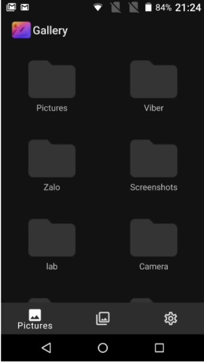

# Project-Gallery-Mobile

(Được fork từ project chính)

### Mô tả sơ lược:
Đồ án cuối kỳ môn Phát triển phần mềm cho thiết bị di động - 19_3 (HCMUS). Ứng dụng giúp quản lý album ảnh với các tính năng chính như:
- Xem ảnh và video nằm ở nhiều folder khác nhau trên bộ nhớ - điện thoại.
- Chỉnh sửa ảnh (cắt, xoay, lật ảnh).
- Chia sẻ ảnh qua các ứng dụng như Messenger, Facebook, Instagram,...
- Thêm ảnh vào các album do người dùng tự tạo và quản lý.
- Đặt hình ảnh thành ảnh nền, ảnh màn hình khóa, xem thông tin ảnh.
- Thêm ảnh bằng cách mở camera máy, hoặc thêm từ internet bằng URL.
- Hiển thị ảnh theo thời gian, theo tên, theo kích thước.
- Thêm vào mục yêu thích (có thể xem đây là một album đặc biệt).
- Xóa ảnh, thêm ảnh vào thùng rác để khôi phục lại sau (thùng rác cũng là một album đặc biệt).
- Zoom ảnh khi xem ảnh toàn màn hình, vuốt qua lại để xem ảnh khác.
- Hỗ trợ dark mode cho giao diện.

### Thông tin nhóm:

|       Họ và tên      |   MSSV   | Email                           | 
|----------------------|:--------:|---------------------------------|
| Đoàn Thu Ngân    | 19120302 | 19120302@student.hcmus.edu.vn            |
| Huỳnh Tấn Thọ | 19120383 | 19120383@student.hcmus.edu.vn |
| Phan Đặng Diễm Uyên         | 19120426 | 19120426@student.hcmus.edu.vn        |
| Sử Nhật Đăng         | 19120469 | 19120469@student.hcmus.edu.vn        |
| Đỗ Thái Duy         | 19120492 | 19120492@student.hcmus.edu.vn        |

### Các chức năng đã làm được:
- Các chức năng và hình ảnh demo được báo cáo đầy đủ trong bản report của link bên dưới: https://docs.google.com/document/d/1EylgX5qexQLUVyCRszZ6IviJM3SjBg00g0_3J80Q7Q0/edit?usp=sharing
- Một vài hình ảnh demo:

